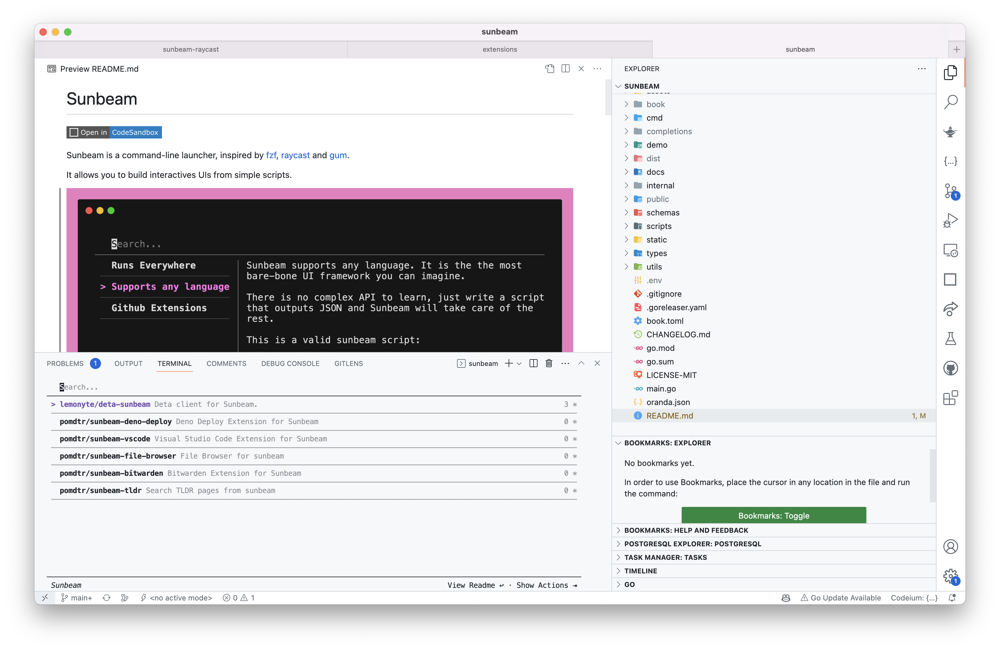

# Sunbeam

Sunbeam is a general purpose command-line launcher.

Define UIs composed of a succession of views from simple scripts written in any language.

  

You can think of it as a mix between an application launcher like [raycast](https://raycast.com) or [rofi](https://github.com/davatorium/rofi) and a fuzzy-finder like [fzf](https://github.com/junegunn/fzf) or [telescope](https://github.com/nvim-telescope/telescope.nvim).

## Features

## Runs on all platforms

Sunbeam is distributed as a single binary, available for all major platforms. Sunbeam also comes with a lot of utilities to make it easy to create cross-platform scripts.

## Supports any language

Sunbeam provides multiple helpers for writing scripts in POSIX shell, but you can also use any other language.
The only requirement is that your language of choice can read and write JSON.

Creating a new extension is as easy as writing a script.

You can share your scripts with others by just hosting them on a public url.

## Integrates with your favorite apps

It is trivial to integrate sunbeam with existings apps since it's just a command-line tool.

More information in the [integrations](https://pomdtr.github.io/sunbeam/book/user-guide/integrations.html) section.

