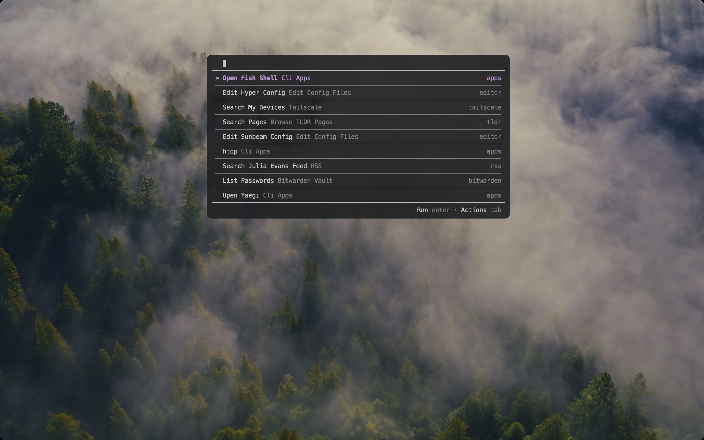

# Integrations

Sunbeam is a terminal-based application, so it can be integrated with any terminal, multiplexer or editor.

Here is a non-exhaustive list of integrations. If you have an integration you would like to share, feel free to open a PR.

## Terminals

### Hyper (recommended)


[Hyper](https://hyper.is/) is a cross-platform terminal emulator, built on web technologies.

Hyper is highly extensible, making it a great host for sunbeam.

You can use the [sunbeam plugin](https://www.npmjs.com/package/hyper-sunbeam) to make hyper behave as an application launcher.
The plugin has been tested on macOS, but it should work on other platforms as well.

Here is an example config:

```js
"use strict";
// See https://hyper.is#cfg for all currently supported options.
module.exports = {
    config: {
        fontSize: 13,
        padding: '10px 0px 5px 5px',
        shell: '/opt/homebrew/bin/fish', // set this to your shell
        shellArgs: ['--login', '-c', 'sunbeam'],
        env: {
            "EDITOR": "vim",
        },
        windowSize: [600, 350],
        modifierKeys: {
            altIsMeta: true
        },
        sunbeam: {
            hotkey: 'Alt+Super+Space', // tweak this to your liking
        }
    },
    // a list of plugins to fetch and install from npm
    plugins: [
        "hyper-sunbeam", // transform hyper into a launcher
        "hyperminimal", // strip title bar
        "hyperborder", // add a gradient border around the window
    ]
};
//# sourceMappingURL=config-default.js.map
```

### Alacritty



[Alacritty](https://github.com/alacritty/alacritty) is a cross-platform terminal emulator.

Alacritty is not easily extensible, so you will have to handle the application launcher features yourself (hotkey, centering, blur, ect.).

It is a good choice if you are already using tiling window manager, as they usually allow you to setup an hotkey to launch a program, and to center it on the screen.

Use this config as a starting point:

```yml
shell:
  program: /bin/bash # set this to your shell
  args: ["-lic", "sunbeam"]

window:
  opacity: 0.9
  decorations: buttonless
  dimensions:
    columns: 90
    lines: 23

  option_as_alt: Both
  padding:
    x: 10
    y: 10

font:
  size: 13.0
```

If you don't plan to use Alacritty as your primary terminal, you can just save it as `~/.config/alacritty/alacritty.yml`.
Otherwise, use the `config-file` flag when launching alacritty: `alacritty --config-file ~/.config/alacritty/sunbeam.yml`.

## Multiplexers

Sunbeam can easily be integrated with terminal multiplexers like tmux or zellij.

### tmux

```sh
tmux popup -E sunbeam # open sunbeam in a popup
tmux display-popup -E sunbeam devdocs list-docsets # list devdocs docsets in a popup
```

To bind it to a key, add this line to your tmux config:

```
bind-key -n C-Space display-popup -E sunbeam
```

### zellij

```sh
zellij run --floating --close-on-exit -- htop
```

Binding this command to a key is not supported yet, as zellij [does not support floating panes in its config file yet](https://github.com/zellij-org/zellij/discussions/2518).

## Editors

### Visual Studio Code


Run the `Tasks: Open User Tasks` item from the command palette, then paste the following text:

```json
{
    "version": "2.0.0",
    "tasks": [
        {
            "type": "shell",
            "label": "sunbeam",
            "command": "sunbeam",
            "presentation": {
                "echo": false,
                "focus": true,
                "close": true
            }
        }
    ]
}
```

Then run the `Preferences: Open Default Keyboard Shortcuts (JSON)` command and add the following keybinding to the list:

```json
{
    "key": "ctrl+alt+p",
    "command": "workbench.action.tasks.runTask",
    "args": "sunbeam"
}
```

Trigger the keybinding and you should see the sunbeam menu appear in the terminal panel.

### Kakoune

You can use the [popup.kak](https://github.com/enricozb/popup.kak) plugin to show sunbeam in a popup.

```
evaluate-commands %sh{kak-popup init}

define-command -override -params .. sunbeam %{ popup --title open -- sunbeam %arg{@} }

map global user <space> ':sunbeam<ret>' -docstring "Show Sunbeam"
```

### Vim / Neovim

Checkout the following plugins:

- [floaterm](https://github.com/voldikss/vim-floaterm)
- [FTerm.nvim](https://github.com/numToStr/FTerm.nvim)
- [toggleterm.nvim](https://github.com/akinsho/toggleterm.nvim)

or just use the `:terminal` command.

## GUI (TODO)

A sunbeam GUI is in the works, but it is not ready yet.

It will be close to the current hyper integration, but available as a standalone app.
